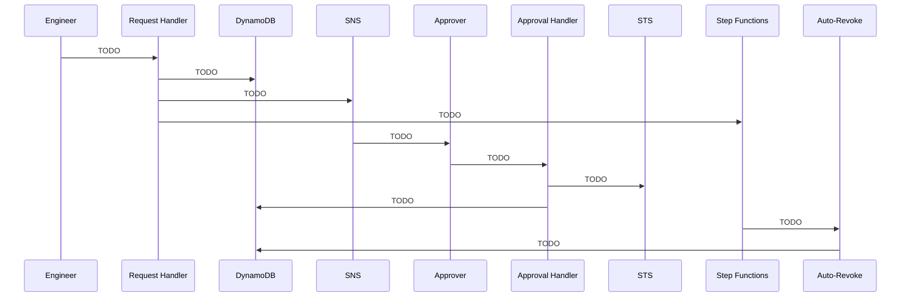

# Serverless Break Glass Access System


A serverless solution for emergency access management.

### Authors
- Roland Awuku
- Habiba Adam Salisu

---

## Table of Contents

- [The Problem](#the-problem)
- [What This System Does](#what-this-system-does)
- [Architecture](#architecture)
- [Access Lifecycle](#access-lifecycle)
- [Security Model](#security-model)
- [Components](#components)
- [Build Walkthrough](#build-walkthrough)
- [End-to-End Test](#end-to-end-test)
- [Lessons Learned](#lessons-learned)
- [Known Limitations](#known-limitations)
- [Roadmap](#roadmap)
- [Repository Layout](#repository-layout)

---

## The Problem

<!-- TODO: 2–3 paragraphs. Why standing admin access is a liability; what teams do today
     (shared root creds, permanent admin roles, a break-glass password in a vault);
     what goes wrong with those. Keep it concrete — name the failure mode you're preventing. -->

---

## What This System Does

<!-- TODO: One paragraph, plain language. The elevator pitch. -->

**In one sentence:** <!-- TODO -->

Key properties:

- **No standing privilege** — <!-- TODO: one line -->
- **Two-person rule** — <!-- TODO: one line -->
- **Hard permission ceiling** — <!-- TODO: one line -->
- **Time-boxed by construction** — <!-- TODO: one line -->
- **Fully audited** — <!-- TODO: one line -->

---

## Architecture

<!-- TODO: Insert architecture diagram here once drawn.
     Suggested tool: draw.io / Excalidraw, exported to screenshots/architecture/diagram.png -->

<!--  -->

<!-- TODO: 1–2 paragraphs walking through the diagram. -->

**Region:** <!-- TODO: e.g. us-east-1 -->
**Scenario implemented:** Scenario A — SSM Session Manager access to a tagged EC2 instance.

---

## Access Lifecycle

<!-- TODO: Consider a mermaid sequence diagram here — GitHub renders it natively.
     Skeleton below; fill in / correct the participants and messages. -->



| Stage | Trigger | What happens | Record state |
|---|---|---|---|
| Request | <!-- TODO --> | <!-- TODO --> | `pending` |
| Approval | <!-- TODO --> | <!-- TODO --> | `active` |
| Expiry | <!-- TODO --> | <!-- TODO --> | `expired` |
| Failsafe | <!-- TODO --> | <!-- TODO --> | `expired` |

---

## Security Model

The design rests on four independent controls. Each one has to fail before privilege escalation is possible.

### 1. Permission boundary as a hard ceiling

<!-- TODO: Explain what a permission boundary is and why it's the centrepiece.
     Emphasise: it caps the role permanently, regardless of what policies get attached later. -->

<!--  -->
<!--  -->

### 2. Tag-scoped resource access

<!-- TODO: Explain the BreakGlassEligible=true condition — access is opt-in per instance. -->

<!--  -->

### 3. Constrained trust policy

<!-- TODO: Explain that only BreakGlass-LambdaExecutionRole can assume the elevated role —
     no human principal can, even with correct credentials. Mention why sts:TagSession is needed. -->

<!--  -->
<!--  -->

### 4. Separation of duties

<!-- TODO: The requester ≠ approver check. Be honest about how it's currently enforced
     (code-level string comparison) and note the limitation — see Known Limitations. -->

### Least privilege on the Lambda execution role

<!-- TODO: Note that this role is the highest-value identity in the system and why. -->

<!--  -->
<!--  -->

---

## Components

| Component | Name | Role in the system |
|---|---|---|
| DynamoDB table | `breakglass-grants` | <!-- TODO --> |
| Permission boundary | `BreakGlass-PermissionBoundary` | <!-- TODO --> |
| Elevated access role | `BreakGlass-ElevatedAccessRole` | <!-- TODO --> |
| Lambda execution role | `BreakGlass-LambdaExecutionRole` | <!-- TODO --> |
| Lambda | `BreakGlass-RequestHandler` | <!-- TODO --> |
| Lambda | `BreakGlass-ApprovalHandler` | <!-- TODO --> |
| Lambda | `BreakGlass-AutoRevoke` | <!-- TODO --> |
| Lambda | `BreakGlass-FailsafeScanner` | <!-- TODO --> |
| SNS topic | `breakglass-approvals` | <!-- TODO --> |
| REST API | `BreakGlass-ApprovalAPI` | <!-- TODO --> |
| State machine | `BreakGlass-StateMachine` | <!-- TODO --> |
| EventBridge rule | `BreakGlass-AssumeRoleAlert` | <!-- TODO --> |
| EventBridge rule | `BreakGlass-FailsafeSchedule` | <!-- TODO --> |
| CloudTrail | <!-- TODO: trail name --> | <!-- TODO --> |
| Security Hub | — | <!-- TODO --> |

### The grants table

| Attribute | Type | Notes |
|---|---|---|
| `grant_id` | String (PK) | <!-- TODO --> |
| `requester` | String | <!-- TODO --> |
| `instance_id` | String | <!-- TODO --> |
| `reason` | String | <!-- TODO --> |
| `duration_minutes` | Number | <!-- TODO --> |
| `status` | String | `pending` → `active` → `expired` |
| `requested_at` | String | <!-- TODO --> |
| `approver` | String | <!-- TODO --> |
| `approved_at` | String | <!-- TODO --> |
| `expires_at` | String | <!-- TODO --> |
| `revoked_at` | String | <!-- TODO --> |

<!--  -->
<!--  -->

---

## Build Walkthrough

The full click-by-click build guide lives in [`break-glass-phase1.md`](break-glass-phase1.md).
<!-- TODO: rename that file once split — it currently contains all five phases. -->

### Phase 1 — Foundation: DynamoDB + permission boundary

<!-- TODO: 2–3 sentences summarising what this phase established and why it comes first. -->

| Evidence | Screenshot |
|---|---|
| DynamoDB table created | <!--  --> |
| Boundary policy JSON | <!--  --> |
| Boundary policy created | <!--  --> |
| Instance tagged | <!--  --> |
| SSM agent reachable | <!--  --> |
| EC2 instance profile | <!--  --> |

### Phase 2 — Identity: the two IAM roles

<!-- TODO: 2–3 sentences. Emphasise the chicken-and-egg ordering (trust policy references a role
     that doesn't exist yet) if that tripped you up. -->

| Evidence | Screenshot |
|---|---|
| Break-glass role trust policy | <!--  --> |
| Boundary attached | <!--  --> |
| Inline access policy | <!--  --> |
| Lambda execution role | <!--  --> |
| Execution role policy | <!--  --> |

### Phase 3 — Logic: the Lambda functions

<!-- TODO: 2–3 sentences. -->

| Evidence | Screenshot |
|---|---|
| Request Handler | <!--  --> |
| Request Handler code | <!--  --> |
| Execution role bound | <!--  --> |
| Approval Handler | <!--  --> |
| Auto-Revoke | <!--  --> |

### Phase 4 — Orchestration: SNS, API Gateway, Step Functions

<!-- TODO: 2–3 sentences. -->

| Evidence | Screenshot |
|---|---|
| SNS topic | <!-- TODO: screenshots/phase_four/... --> |
| Subscription confirmed | <!-- TODO --> |
| API Gateway resource + method | <!-- TODO --> |
| API deployed to stage | <!-- TODO --> |
| State machine definition | <!-- TODO --> |
| Execution graph | <!-- TODO --> |

### Phase 5 — Audit and failsafe

<!-- TODO: 2–3 sentences. -->

| Evidence | Screenshot |
|---|---|
| CloudTrail logging | <!-- TODO: screenshots/phase_five/... --> |
| Security Hub enabled | <!-- TODO --> |
| AssumeRole alert rule | <!-- TODO --> |
| Failsafe schedule | <!-- TODO --> |
| Failsafe scanner run | <!-- TODO --> |

---

## End-to-End Test

**Tested:** <!-- TODO: date --> · **Result:** <!-- TODO: pass / pass with fixes -->

<!-- TODO: Narrate the actual run you did. This is the most credible section in the whole
     document — a real trace beats any amount of description. Suggested shape below. -->

**Scenario:** <!-- TODO: e.g. "Engineer needs shell access to an unresponsive production instance." -->

| # | Step | Expected | Observed | Evidence |
|---|---|---|---|---|
| 1 | Submit request | <!-- TODO --> | <!-- TODO --> | <!-- TODO --> |
| 2 | Grant written as `pending` | <!-- TODO --> | <!-- TODO --> | <!-- TODO --> |
| 3 | Approval email delivered | <!-- TODO --> | <!-- TODO --> | <!-- TODO --> |
| 4 | State machine waiting | <!-- TODO --> | <!-- TODO --> | <!-- TODO --> |
| 5 | Approver clicks link | <!-- TODO --> | <!-- TODO --> | <!-- TODO --> |
| 6 | STS credentials issued | <!-- TODO --> | <!-- TODO --> | <!-- TODO --> |
| 7 | SSM session opened | <!-- TODO --> | <!-- TODO --> | <!-- TODO --> |
| 8 | EventBridge tripwire fired | <!-- TODO --> | <!-- TODO --> | <!-- TODO --> |
| 9 | Timer expires, grant revoked | <!-- TODO --> | <!-- TODO --> | <!-- TODO --> |
| 10 | Session no longer usable | <!-- TODO --> | <!-- TODO --> | <!-- TODO --> |

### Negative tests

<!-- TODO: These prove the controls actually bite. Worth doing if you haven't yet. -->

| Test | Expected result | Observed |
|---|---|---|
| Requester approves own request | `403` | <!-- TODO --> |
| Approve an already-approved grant | `409` | <!-- TODO --> |
| Session against an untagged instance | `AccessDenied` | <!-- TODO --> |
| Any non-SSM API call with the credentials | `AccessDenied` | <!-- TODO --> |
| Credentials used after expiry | `ExpiredToken` | <!-- TODO --> |

---

## Lessons Learned

<!-- TODO: The most valuable section for a reader. Real problems, real diagnosis, real fixes.
     Use the shape below for each one. -->

### SSM Session Manager needs the session document in the boundary

**Symptom:** <!-- TODO: what the error looked like, verbatim if you have it -->

**Diagnosis:** `ssm:StartSession` authorises against *two* resources, not one — the target EC2 instance **and** the Session Manager document (e.g. `SSM-SessionManagerRunShell`). The permission boundary as originally written only allowed the instance, so the call was denied at the document. The `ssm:resourceTag/BreakGlassEligible` condition also cannot apply to a document ARN, so the document needs its own statement rather than being folded into the existing one.

**Fix:** <!-- TODO: paste the corrected boundary statement here -->

```json
<!-- TODO: the revised policy JSON -->
```

**Takeaway:** <!-- TODO: 1–2 sentences on the general principle — a permission boundary is only
     as good as your understanding of which resources an API call actually touches. -->

### <!-- TODO: second lesson, if any -->

<!-- TODO -->

---

## Known Limitations

<!-- TODO: Keep this section. Naming your own gaps reads as competence, not weakness —
     and it doubles as the backlog. Starters below; edit, expand, or remove. -->

| # | Limitation | Impact | Planned fix |
|---|---|---|---|
| 1 | Approval endpoint is unauthenticated and `approver` is supplied by the caller | Anyone with the URL can approve; the requester ≠ approver check can be bypassed by changing the query string | HMAC-signed single-use token, or an API Gateway authorizer |
| 2 | Approval is a `GET` | Email link scanners may prefetch the URL and approve a request automatically | Confirmation page on `GET`, state change on `POST` |
| 3 | STS credentials are emailed in plaintext to the SNS topic | Credentials persist in mailboxes and delivery logs, and reach the approver rather than the requester | Notify only; requester retrieves credentials once from an authenticated endpoint |
| 4 | Approval is read-then-write without a condition expression | Two concurrent approvals can both issue credentials | `ConditionExpression` on the status update |
| 5 | Auto-revoke updates the record but cannot cut a live session short | Credentials remain valid until natural expiry | `aws:TokenIssueTime` deny policy plus `ssm:TerminateSession` |
| 6 | Pending requests never expire | A stale request can be approved days later | Age check against `requested_at` |
| 7 | Failsafe uses `Scan` | Cost and latency grow with table size | GSI on `status`, queried instead |
| 8 | ARNs are hardcoded in function source | Four manual edits per environment; easy to miss one | Lambda environment variables |
| 9 | Built by console click-through | Not reproducible; no review trail on infrastructure changes | Terraform — see `terraform/` |

---

## Roadmap

- [ ] Codify the whole stack in Terraform (`terraform/main.tf` is currently a placeholder)
- [ ] <!-- TODO: signed approval tokens -->
- [ ] <!-- TODO: Slack interactive approve/deny buttons in place of email -->
- [ ] <!-- TODO: explicit deny path with audit record -->
- [ ] <!-- TODO: second scenario — scoped S3 access -->
- [ ] <!-- TODO: CloudWatch dashboard -->

---

## Repository Layout

```
.
├── README.md                  # This document
├── break-glass-phase1.md      # Full console build guide, phases 1–5
├── terraform/                 # Infrastructure as code (in progress)
│   └── main.tf
└── screenshots/               # Build and test evidence
    ├── phase_one/             # DynamoDB, permission boundary, EC2 tagging
    ├── phase_two/             # IAM roles and policies
    └── phase_three/           # Lambda functions
```

---

## Cost Note

<!-- TODO: Worth a short paragraph. Most of the stack is free-tier friendly, but Security Hub
     and CloudTrail data events are not. Flag anything a reader reproducing this should know
     before enabling. -->

---

## License

See [LICENSE](LICENSE).
